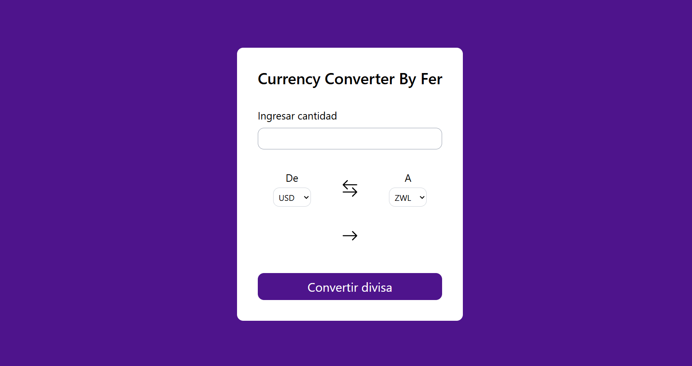
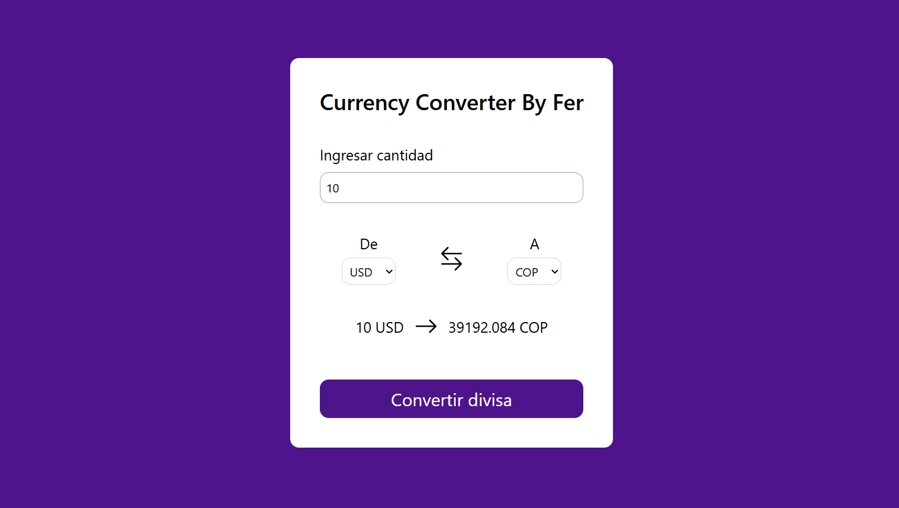

# 💸 Currency Converter APP

Aplicación web que permite convertir entre distintas divisas de forma rápida y en tiempo real gracias al consumo que implemente de una **[API](https://www.exchangerate-api.com/)**. Su interfaz intuitiva facilita al usuario seleccionar monedas, ingresar un valor y obtener la conversión inmediata, ideal para viajeros, comerciantes o cualquier persona que necesite conocer equivalencias de monedas al instante.

## 🚀 Características

- Conversión entre múltiples monedas con tasas actualizadas.
- Interfaz limpia y responsiva gracias a Tailwind CSS.
- Selección de divisas mediante menús desplegables fáciles de usar.

## 📸 Screenshots

### Pantalla principal

## ⚙️ Instalación

1. Clona este repositorio
2. Entra en la carpeta del proyecto
3. Instala la dependencias: **npm install**
4. Inicia el servidor de desarrollo: **npm run dev**

El sitio se abrirá en http://localhost:5173
(o el puerto que Vite te indique).

## 🖥️ Tecnologías Utilizadas

- React
- Tailwind CSS

## 👨‍💻 Autor

Desarrollado por [mí](https://github.com/FerDeveloperJS).
